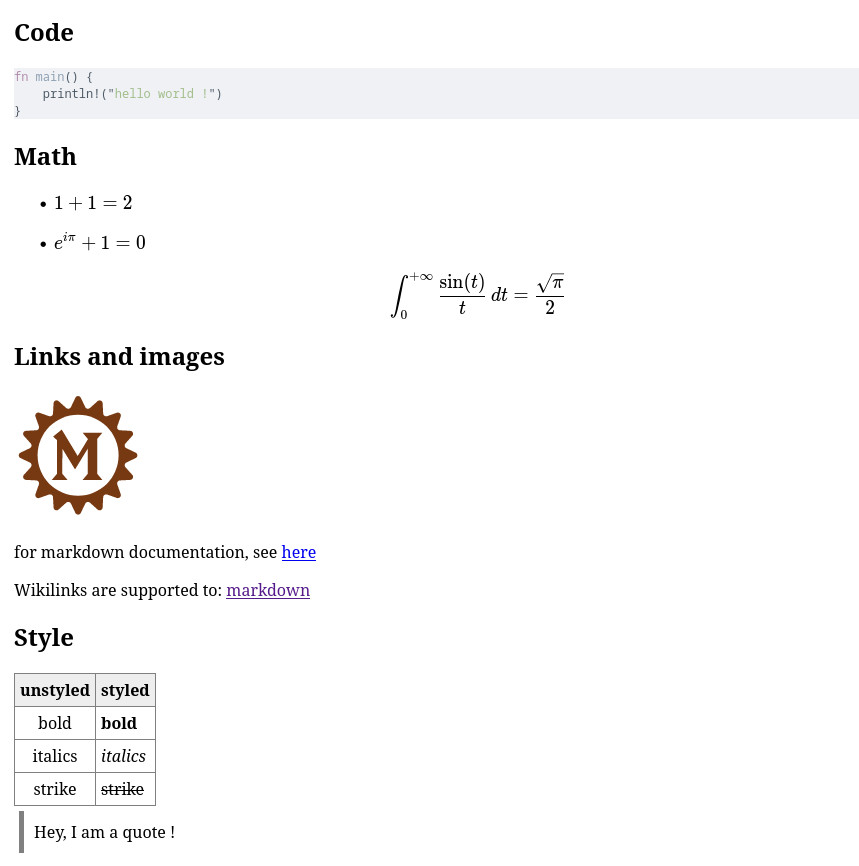

A zero-config but extendable markdown component for [leptos](https://www.leptos.dev/).

It supports [commonmark](https://commonmark.org/), and so much more.

# Installation
`leptos-markdown` is not published on crates.io yet.
Use it as a git dependency !
```toml
# inside Cargo.toml
leptos-markdown = {git="https://github.com/rambip/leptos-markdown"}
```

# Usage
You can use this component to render both static and dynamic markdown.

## Static markdown

```rust
use leptos::*;

{
    ...
    view!{cx,
        <Markdown src="# Markdown Power !"/>
    }
}
```

## Dynamic markdown
```rust
{
    ...
    let (content, set_content) = create_signal(cx, "# Markdown Power !".to_string());

    view!{cx,
        <Markdown src=content/>
    }
}
```


# Examples
To build them, just follow the [leptos installation instructions](https://leptos-rs.github.io/leptos/02_getting_started.html) and run `trunk serve` to try them.

## Showcase


`./examples/showcase`

You can see the result [here](https://rambip.github.io/leptos-markdown/showcase)

To be fair, this is not the vanilla component, there is a bit of styling added.

## Editor
`./examples/editor`

There is a demo of an interactive editor [here](https://rambip.github.io/leptos-markdown/editor)

## Onclick
`./examples/onclick/`

Illustrates a cool feature of this crate: `onclick` events for any rendered content

Try it [here](https://rambip.github.io/leptos-markdown/onclick)

## Custom components

This feature is still very experimental.
But there is an exemple [here](https://rambip.github.io/leptos-markdown/custom-component)

# Comparison
I already built a similar library using yew [here](https://github.com/rambip/yew-markdown/)
This project was great to compare the advantages and drawbacks of the two major rust web frameworks !

see [my feedback](./feedback/README.md) for a comparison

